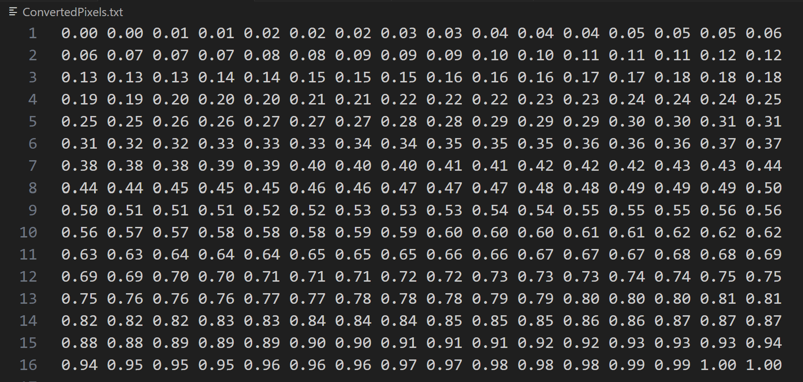

# Grayscale Image Conversion Project

## Overview
A grayscale image is internally represented as a 2 dimensional array. Size is defined by the number of pixels in a row (width), and number of pixels in a column (height). Each cell represents the pixel value. Pixel values in grayscale are represented as white, black, and shades of gray using different numerical data type representation depending on the library used.

Some Libraries represent using 8 bit unsigned integer. 0 for black, 255 for white, 64 light gray, 191 dark gray, and all other gray values in between.
Some Image Processing Libraries represent grayscale images as having double float based pixel values between 0 to 1. 0 for black, 1 for white, 0.25 light gray, 0.75 darker gray, and all other gray values in between.

## Implementation
This project uses **C** to collect inputs, allocate memory, and print output. The C program acts as the driver. It manages user input for image dimensions (width and height) and ensures that sufficient memory is dynamically allocated using `malloc`.

The core computational logic is offloaded to an external **x86-64 assembly file**. This assembly module receives the total number of pixels and a pointer to the image array and iterates through every pixel. It converts the integer image value to a double precision float using the following formula:

$$f = \frac{\text{pixel}}{255.0}$$

This normalizes the pixel intensity, mapping the integer range to the floating-point range.
## Test Results
The program was tested with four text files: the first three, which increased in size, to evaluate execution efficiency, and the last one to verify correctness.
*Note: Full data can be viewed at the bottom*

### 1. Small Scale Test (10 * 10)
* **Total Pixels:** 100
* **Correctness:** Integer inputs were accurately converted to their double-precision equivalents. Edge cases were verified successfully; for example, `0` mapped correctly to `0.00` and `255` to `1.00`. The total number of input pixels remained equal to the number of output pixels.
* **Performance:** Execution was instantaneous. Across all 30 test runs, the recorded time was consistently `0.000` seconds.

### 2. Medium Scale Test (100 * 100)
* **Total Pixels:** 10,000
* **Correctness:** Conversion logic remained consistent with the small-scale test, maintaining accuracy across all 10,000 data points. Edge case mapping (0 and 255) remained correct. The input pixel count matched the output pixel count.
* **Performance:** Similar to the 10x10 case, the processing time remained negligible. All 30 runs recorded a time of `0.000` seconds.

### 3. Large Scale Test (1000 * 1000)
* **Total Pixels:** 1,000,000
* **Correctness:** Validity checks confirmed that arithmetic precision is maintained even at high volume. All inputs, including boundary values, were converted correctly. The input had the same number of pixels as the output.
* **Performance:** At this volume, processing time became measurable but remained highly efficient. Execution times ranged from a minimum of `0.004` seconds to a maximum of `0.006` seconds.

### 4. Values from 0 to 256 (16*16)
* **Total Pixels:** 256
* **Correctness:** The output appeared as expected. An input of 0 corresponds to 0.0, and an input of 255 corresponds to 1.0. The output also increases as expected from 0 to 256. Since the decimals are limited to two places, some input values, such as 0 and 1, produce the same output.

### Overall Analysis
The test results demonstrate that the x86-64 assembly module is highly optimized for this floating-point operation. For small and medium datasets, the computational cost is effectively zero relative to the system clock resolution. Notably, initializing the input array took way more time.

Even at the large scale (1 million pixels), the conversion takes less than 6 milliseconds on average. The observation that initialization time exceeds conversion time indicates that the primary bottleneck of the program is memory access and I/O overhead, rather than the computational logic itself. This confirms that offloading the arithmetic to assembly provided the expected performance benefits.
  
## Appendix

** Results Table **
| 10*10 | 100*100 | 1000*1000 |
| :--- | :--- | :--- |
| 0.000 | 0.000 | 0.005 |
| 0.000 | 0.000 | 0.005 |
| 0.000 | 0.000 | 0.004 |
| 0.000 | 0.000 | 0.004 |
| 0.000 | 0.000 | 0.004 |
| 0.000 | 0.000 | 0.004 |
| 0.000 | 0.000 | 0.005 |
| 0.000 | 0.000 | 0.004 |
| 0.000 | 0.000 | 0.004 |
| 0.000 | 0.000 | 0.004 |
| 0.000 | 0.000 | 0.005 |
| 0.000 | 0.000 | 0.005 |
| 0.000 | 0.000 | 0.004 |
| 0.000 | 0.000 | 0.004 |
| 0.000 | 0.000 | 0.004 |
| 0.000 | 0.000 | 0.005 |
| 0.000 | 0.000 | 0.005 |
| 0.000 | 0.000 | 0.004 |
| 0.000 | 0.000 | 0.005 |
| 0.000 | 0.000 | 0.004 |
| 0.000 | 0.000 | 0.005 |
| 0.000 | 0.000 | 0.005 |
| 0.000 | 0.000 | 0.004 |
| 0.000 | 0.000 | 0.005 |
| 0.000 | 0.000 | 0.005 |
| 0.000 | 0.000 | 0.004 |
| 0.000 | 0.000 | 0.005 |
| 0.000 | 0.000 | 0.004 |
| 0.000 | 0.000 | 0.004 |
| 0.000 | 0.000 | 0.006 |

**Demo Link:** [YouTube](https://youtu.be/OmX_Ae9fHGo)